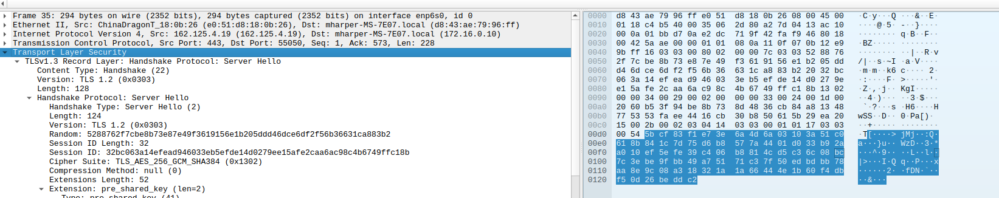

# Computer_and_network_security
Cybersecurity proposal

## Server
One of the first things we wanted to look into was using the same port for both TLS and Non-TLS connections. To do this we use `recv` to peak at the first few bytes to determine if the packet is one that contains a `Server Hello` message as part of TLS which will start with `0x16 0x03`, or if it is one of our Custom Request packets.

We can see a wireshark capture below showing a Server Hello Message Dump:
